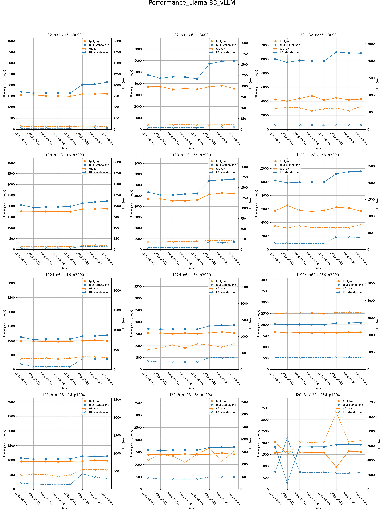

# CI Tool
## Introduction
This tool provides automated **ROCm** benchmarking for inference engines, including **vLLM** and **SGLang**, with optional **Ray** integration.  
Currently, it supports Llama 3.1–8B and Llama 3.3–70B, but it can be extended to other models.
The tool performs the following actions as part of a CI test:
1. Download Models
2. Pull Latest ROCm vLLM/SGLang Docker images
3. vLLM Benchmark
   1. Accuracy Test
   2. Performance Test
4. SGLang Benchmark
   1. Accuracy Test
   2. Performance Test
5. Visualization: Transform benchmark results stored in JSON files into graphical plots, as illustrated below.

## Hardware
Since the Docker images are built on top of ROCm, this tool is intended to run on ROCm GPUs such as **MI300X** and **MI325X**.  
It should also work on newer ROCm GPUs like the **MI355X**, although the Docker images may need to be updated accordingly.

## Benchmark
Clone this repo and run the following cmd. The whole CI test may take around 3hr on MI300X/MI325X.
```
./main.sh
```

# Known Issue
*  We currently support benchmarking **vLLM + Ray**. Support for **SGLang + Ray** is still in progress, with the AMD team contributing to the SGLang integration into Ray.  
* **Ray overhead:** See the example in the figure below. The orange and blue solid lines represent vLLM standalone and vLLM + Ray, respectively, showing a clear performance gap between running with and without Ray.  
  This issue is not related to ROCm GPUs. The Ray community is aware of the problem and is working to reduce the overhead.

 
